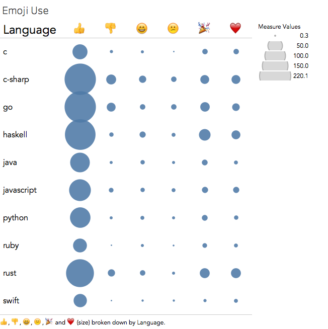
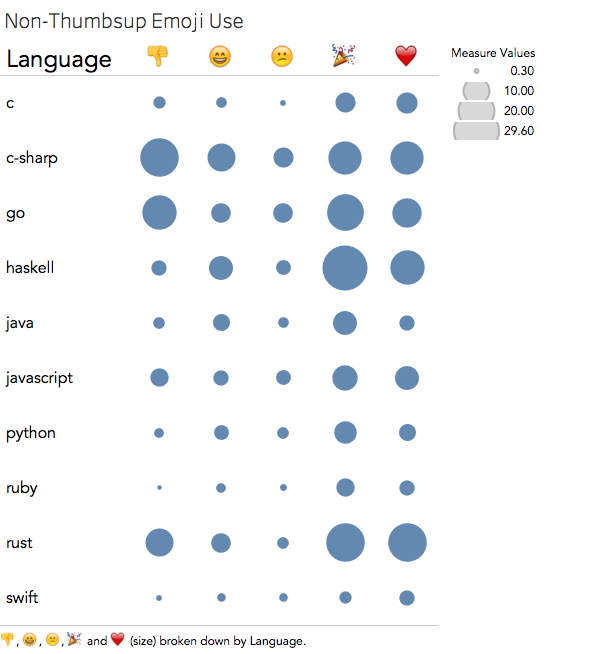
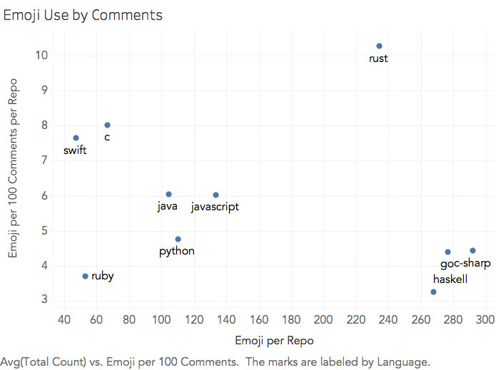
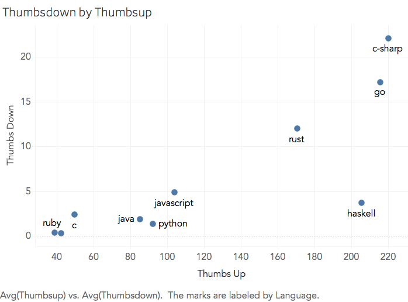

# Software development is social

- Software is built collaboratively
- GitHub is a platform for "social coding"
- GitHub users collaborate on many tasks:
    - reporting bugs
    - discussing future changes
    - reviewing code quality

# Programming languages create communities

- Each project has a primary language
- Same language? Same habits & customs
- Language communities accumulate stereotypes
    - C, C++? \(\to\) "old-school"
    - JavaScript, Ruby? \(\to\) "hip"
    - SML, Haskell? \(\to\) "academic"

# Key Findings from Existing Research

- Interactions between core and new members differed from
  interactions among core members.
- Discussions tended to involve core and peripheral
  developers, not just core developers.
- Prior interaction increases likelihood of pull request
  acceptance
- Developers with higher stakes in the project are more
  likely to engage in discussions

# Our question:

\Large{How does social activity on GitHub vary by
programming language community?}

# For the midterm report, we narrowed in on:

\Large{How does emoji use vary by language community?}

# Emoji on the GitHub platform

GitHub lets users

- write emoji in comment bodies
- add Slack-style "reactions" to other people's comments

We looked at **reactions**.

# Choosing projects to sample

- For 10 hand-selected programming languages,
    - Pick 10 random projects using that language where:
        - the project has between 1,000 and 4,000 stars
          (moderately popular)
        - the project was updated within the last 3 months
          (moderately active)

**Result**: 100 random projects, 10 in each language, where:

- popularity held constant (not just popularity contest)
- project isn't abandoned (still part of the community)

# Getting the data

- For each sampled project,
    - Fetch all reactions on all comments
    - Add up how many times each emoji was used

- For each language,
    - Average the number of times each emoji was used

**Result**: average number of emoji used across 10 languages

#

\Large{Visualizing the Result}

# Emoji Use by Language

\ 

<!--
- Across all languages, "thumbs up" is very popular
- It looks like C#, Go, Haskell, and Rust use emoji the most
- Let's drill deeper...
-->

# Emoji Use by Language (no Thumbsup)

\ 

<!--
- Confirmed that C#, Go, Haskell, and Rust use the most
- Surprisingly, we thought JavaScript, Python, and Ruby
  would use emoji more (based on cultural preconceptions)
- C# is strongly associated with Microsoft; didn't expect
  "corporate" community to be big on emoji
- Let's drill deeper...
-->

# Emoji Use by Comment Volume

\ 

<!--
- Of the top four (C#, Go, Haskell, Rust), only Rust has
  lots of emoji and high emoji density
- (i.e., C#, Go, and Haskell just talk a lot, and accumulate
  more emoji by nature of having longer discussions)
- C and Swift communities are people of few comments, but
  they have the 2nd and 3rd highest emoji density per
  comment! (Earlier, we thought they hardly used emoji at
  all)
- Let's drill deeper...
-->

# Thumbsdown by Thumbsup

\ 

<!--
- People generally use thumbs up proportionally to how much
  they use thumbs down. (trend line upward)
- However, Haskell people must all get along: lots of thumbs
  ups with very few thumbs downs
-->

# Possible questions for next time:

- Which other language communities does this community talk
  about?
- What influence does contribution time (day, night, ...)
  have on discussions?
- When do people comment, versus when do they contribute
  code?
- Are discussions resolved quickly, or do they drag on?

<!-- vim:tw=60 sts=4 sw=4
-->
